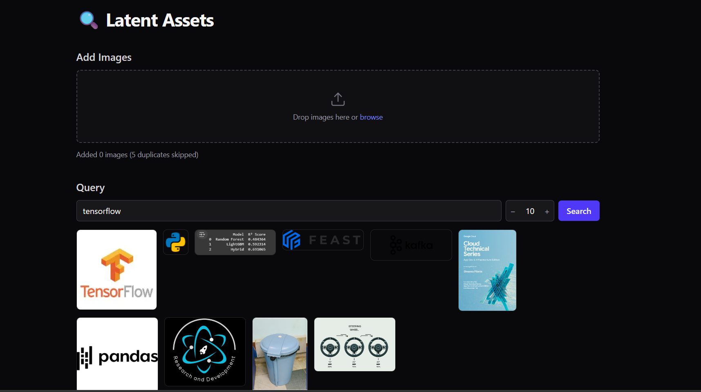

# 🔍 Latent Assets

**Latent Assets** is a powerful, modern image management system that leverages vector embeddings and semantic search to organize and retrieve your images based on their content, not just their filenames.



## 🚀 Features

- **Semantic Image Search**: Find images using natural language queries (e.g., "sunset at the beach" or "modern architecture").
- **Drag & Drop Upload**: Easily add multiple images with an intuitive, interactive interface.
- **Smart Tagging**: Manually add or edit tags for your images to enhance searchability.
- **One-Click Copy**: Copy images directly to your clipboard for quick sharing.
- **Modern UI**: A sleek, dark-themed interface built with React and Tailwind CSS.
- **Fast Search**: Powered by Qdrant vector database for sub-millisecond similarity search.

## 🏗️ Architecture

The project consists of three independent services:

1.  **Embedding Server**: A FastAPI service that uses high-performance ML models (like CLIP) to convert images into high-dimensional vectors.
2.  **Backend API**: The central hub that manages the Qdrant vector store, handles file storage, and coordinates between the frontend and embedding server.
3.  **Frontend**: A responsive React application providing the user interface for searching and uploading assets.

## 🛠️ Tech Stack

- **Frontend**: React, TypeScript, Vite, Tailwind CSS
- **Backend/API**: Python, FastAPI, Pydantic, UV
- **Vector Store**: Qdrant
- **ML/Embeddings**: Sentence-Transformers, PyTorch, Pillow

## 🏁 Getting Started

### Prerequisites

- [UV](https://github.com/astral-sh/uv) (for Python package management)
- [Node.js & NPM](https://nodejs.org/)

### 🏃 Running the Services

You need to run all three services simultaneously.

#### 1. Embedding Server
```bash
cd experiments/inference_api
uv run fastapi dev fastapi_server.py --port 9999
```

#### 2. Backend API
```bash
cd latent-assets/backend
uv run fastapi dev main.py
```

#### 3. Frontend
```bash
cd latent-assets/frontend
npm install
npm run dev
```

The application will be available at **http://localhost:5173**.

## ⚙️ Configuration

System configuration such as storage paths and API endpoints can be found in `latent-assets/backend/config.yaml`.

```yaml
assets_directory: ./assets
vector_store_directory: ./vector_store
embedding_endpoint: http://localhost:9999
collection_name: image_assets
embedding_dimension: 512
```

## 📝 License

This project is open-source and available under the MIT License.
